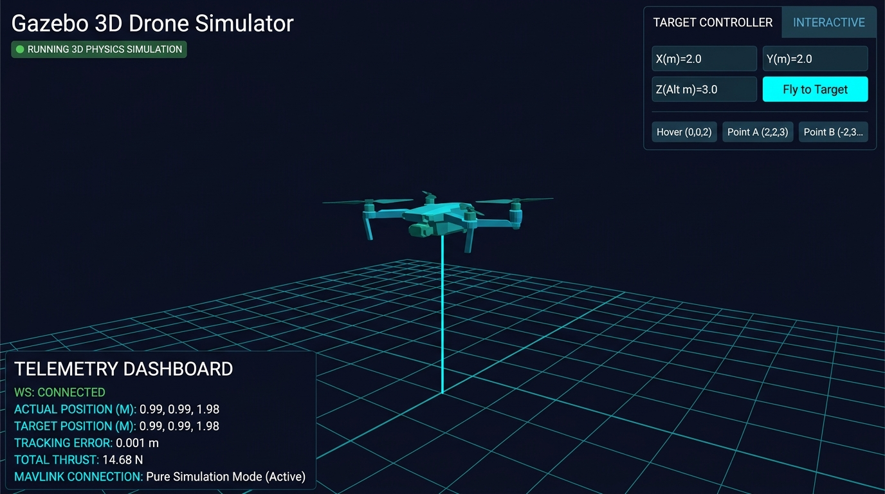

<p align="center">
  
</p>

<h1 align="center">Quadrotor Backstepping Trajectory Tracking Control</h1>

<p align="center">
  <b>Real-Time Quaternion-Based Backstepping Controller with Gazebo 11 Simulation</b><br>
  Amrita Vishwa Vidyapeetham
</p>

---

## Project Guide

| Role | Name | Email |
|---|---|---|
| 👨‍🏫 Faculty Supervisor | **Prof. S. Sunil Kumar** | [s_sunilkumar@cb.amrita.edu](mailto:s_sunilkumar@cb.amrita.edu) |

---

## Team Members

| S. No. | Name | Roll Number | Email |
|---:|---|---|---|
| 1 | Kallam Pratheep Reddy | CB.SC.U4AIE24021 | kallampratheepreddy72@gmail.com |
| 2 | Chaithanya G Nambiar | CB.SC.U4AIE24013 |Cb.sc.u4aie24013@cb.students.amrita.edu |
| 3 | Surabhi Saha | CB.SC.U4AIE24057 | saha8.surabhi@gmail.com |
| 4 | Anakha | CB.SC.U4AIE24006 | anakhas443@gmail.com |
| 5 | Mahendra Mula | CB.SC.U4AIE24033 | maheshbanu58@gmail.com |

---

## Abstract

This project implements a real-time **Backstepping Quaternion Trajectory Tracking Controller** for a quadrotor helicopter, simulated inside **Native Gazebo 11** via WSL2 Ubuntu on Windows. The control design is based on the decoupled quaternion parametrization proposed by De Monte & Lohmann (2013), which splits the attitude quaternion into a tilt component $q_{xy}$ and a heading component $q_z$. This decomposition allows the translational and yaw dynamics to be controlled independently, yielding a cleaner and more analytically tractable backstepping procedure. The system executes autonomous 3D flight trajectories — a Helical Spiral and a 3D Figure-8 Loop — while streaming live 6-DOF telemetry to a WebSocket-based browser visualizer at 50 Hz. An optional ArduPilot SITL/MAVLink bridge (`SITLBridge`) is included for hardware-in-the-loop extension.

---

## 1. Introduction

Autonomous quadrotor navigation requires simultaneously solving two coupled problems: generating a trajectory that is dynamically feasible and controlling the vehicle's attitude and position precisely enough to track it in real time.

**Why quaternions instead of Euler angles.**
Euler angle representations suffer from gimbal lock — a singularity where two rotational axes become aligned, causing a loss of one rotational degree of freedom and unstable controller behavior near that configuration. Unit quaternions represent orientation globally and without this singularity. This project uses quaternions throughout the attitude estimation and control pipeline.

**Why Backstepping.**
Backstepping is a recursive Lyapunov-based design method that exploits the cascaded structure of the quadrotor plant. At each stage of the cascade (position → velocity → thrust → attitude → angular rate), a virtual control law is derived that provably drives the corresponding error to zero, with a Lyapunov function constructed for the complete closed-loop system. This gives a constructive stability proof that purely PID-based approaches do not provide.

**Why the Decoupling Quaternion Parametrization.**
The key contribution of the base paper (De Monte & Lohmann, 2013) is a factorization $q = q_{xy} \otimes q_z$ that decouples the tilt degree of freedom (which affects translational dynamics) from the heading (yaw) degree of freedom, allowing two independent tracking control laws to be derived analytically within the backstepping framework.

---

## 2. Problem Statement

The objective of this project is to develop and simulate a real-time backstepping controller for a quadrotor that:

- Represents attitude as a unit quaternion, free from gimbal-lock singularities.
- Decomposes attitude into tilt ($q_{xy}$) and heading ($q_z$) to decouple translational and yaw dynamics.
- Executes pre-planned 3D trajectories (hover → helical spiral → figure-8 loop) in a physics simulator (Gazebo 11).
- Supports real-time custom target setpoints via a CLI utility and file-based IPC.
- Streams live 6-DOF telemetry at 50 Hz via WebSocket to a browser-based dashboard.
- Provides an optional MAVLink bridge for ArduPilot SITL or real hardware integration.

---

## 3. Base Paper

**De Monte, P. & Lohmann, B. (2013).** *"Trajectory Tracking Control for a Quadrotor Helicopter based on Backstepping using a Decoupling Quaternion Parametrization."* 21st Mediterranean Conference on Control & Automation (MED), Platanias-Chania, Crete, Greece, June 25–28, 2013. IEEE.

### Main Contributions of the Paper

- A novel factorization of the attitude quaternion into tilt ($q_{xy}$) and heading ($q_z$) components.
- Proof that this decomposition decouples the translational and yaw dynamics.
- A full backstepping trajectory tracking control law with analytical Lyapunov stability proof.
- Experimental validation on an AscTec Hummingbird at 50 Hz with a Vicon motion capture system.

### Relation to the Present Project

The present project implements the quaternion decomposition and backstepping control law from the paper in Python, and validates it in a Gazebo 11 3D simulation. The helix trajectory parameters (period times 6.25 s and 12.5 s) are taken directly from the paper's Fig. 4 experiment. Gains are re-tuned as scalar values for the simulation context.

---

## 4. Methodology

The system is implemented as four integrated layers, each independently testable.

---

### 4.1 Quaternion Attitude Parametrization

$$\dot{q} = \frac{1}{2} Q(q) \begin{bmatrix} \omega \\ 0 \end{bmatrix}$$

> **📘 What this means:**
> A **quaternion** $q = (w, x, y, z)$ is a 4-number way to describe how the drone is tilted in 3D space, without the "gimbal lock" problem that Euler angles (roll/pitch/yaw) have.
> This formula says: *"The rate at which the drone's orientation is changing equals half the current orientation multiplied by the angular velocity $\omega$."*
> In simple terms — if the drone is spinning, this tells us how the quaternion changes every moment to stay up-to-date with the rotation.
> - $\omega$ = the drone's spin rate (how fast it rotates around each axis)
> - $Q(q)$ = a matrix built from the current quaternion that combines the rotation math

---

### 4.2 Decoupled Attitude Decomposition

$$q = q_{xy} \otimes q_z$$

> **📘 What this means:**
> This is the **key idea** from the paper. Instead of dealing with one complex quaternion for all rotation, we split it into two simpler parts:
> - $q_{xy}$ = the **tilt** quaternion — describes how much the drone is leaning (roll + pitch), which directly controls where the thrust points
> - $q_z$ = the **heading** quaternion — describes which direction the drone is facing (yaw)
> - $\otimes$ = quaternion multiplication (combining two rotations)
>
> **Why this matters:** By splitting them, we can control the drone's position and heading *independently* — like separate steering wheels for "where to go" and "which way to face".

The elements are extracted from the full quaternion $q = (q_1, q_2, q_3, q_4)$ as:

$$q_p = \sqrt{q_3^2 + q_4^2}$$

> **📘** $q_p$ is the **magnitude of the heading part**. It's used as a denominator to normalize the tilt components below.

$$q_x = \frac{q_4 q_1 - q_3 q_2}{q_p}, \qquad q_y = \frac{q_4 q_2 + q_3 q_1}{q_p}$$

> **📘** $q_x$ and $q_y$ are the **tilt components** (roll + pitch information). They tell us the direction the drone's top (thrust axis) is pointing, relative to straight up.

$$q_w = \frac{|q_4|}{q_p}, \qquad q_z = \mathrm{sgn}(q_3 \cdot q_4)\frac{|q_3|}{q_p}$$

> **📘** $q_w$ and $q_z$ are the **heading components** (yaw information). The sign function $\mathrm{sgn}(\cdot)$ ensures we always pick the "short way round" for rotation — like turning 90° right instead of 270° left — preventing the "unwinding" problem where a drone spins unnecessarily.

---

### 4.3 Translational Dynamics

$$\dot{x} = v, \qquad m\dot{v} = mg\hat{e}_3 + T$$

> **📘 What this means:**
> These two equations describe **how the drone moves through space**:
> - $\dot{x} = v$ — the position changes at the rate of the velocity. Simple: if you're moving at 2 m/s, your position changes by 2 m every second.
> - $m\dot{v} = mg\hat{e}_3 + T$ — this is Newton's second law (Force = mass × acceleration) for the drone. The forces acting on it are:
>   - $mg\hat{e}_3$ = gravity pulling downward
>   - $T$ = the thrust force from the propellers pushing upward/sideways
>
> The controller's job is to choose the right $T$ (thrust direction + magnitude) to overcome gravity and move to the target position.

---

### 4.4 Backstepping Position Control

Backstepping works like a **chain of goals**: first fix position, then fix velocity, then fix thrust — each step building on the previous one.

**Step 1 — Define how far off we are from the target position:**

$$z_x = x - x_T$$

> **📘** $z_x$ is the **position error** — how far the drone currently is from where it should be. If the drone is at (3, 0, 2) m and the target is (5, 0, 2) m, then $z_x = -2$ m in X.

$$V_x = \frac{1}{2} z_x^\top z_x$$

> **📘** $V_x$ is a **Lyapunov function** — think of it as an "energy" that we want to shrink to zero. When $V_x = 0$, the position error is zero and the drone is exactly at the target. The backstepping method guarantees this energy always decreases.

$$v_d = \dot{x}_T + A_x z_x, \quad A_x < 0$$

> **📘** $v_d$ is the **desired velocity** the drone should have right now. It has two parts:
> - $\dot{x}_T$ = the velocity the trajectory itself is moving at (feedforward)
> - $A_x z_x$ = a correction term that pushes toward the target (since $A_x < 0$, a positive error produces a negative correction, pulling the drone back)

**Step 2 — Define how far off the velocity is:**

$$z_v = v - v_d$$

> **📘** $z_v$ is the **velocity error** — how different the current speed is from the desired speed $v_d$ computed above.

$$\ddot{x}_{des} = \ddot{x}_T + k_{pos}(x_T - x) + k_{vel}(\dot{x}_T - v)$$

> **📘** This is the **desired acceleration** the drone should achieve. It has three components:
> - $\ddot{x}_T$ = the trajectory's own acceleration (feedforward — anticipates where the path is going)
> - $k_{pos}(x_T - x)$ = position correction — if too far from target, accelerate toward it
> - $k_{vel}(\dot{x}_T - v)$ = velocity correction — if moving too slow/fast, correct the speed

$$\vec{T} = m\,g\hat{e}_3 + m\,\ddot{x}_{des}$$

> **📘** The **required thrust vector**. To achieve the desired acceleration, the drone needs:
> - $m\,g\hat{e}_3$ = enough thrust to just cancel gravity (hover thrust)
> - $m\,\ddot{x}_{des}$ = extra thrust to produce the desired movement
>
> The direction of $\vec{T}$ tells us which way to tilt the drone; its magnitude is how hard the motors spin.

**Horizontal acceleration cap:**

$$a_{xy} \leftarrow \frac{a_{xy}}{\|a_{xy}\|} \cdot \min(\|a_{xy}\|,\ 5.0) \text{ m/s}^2$$

> **📘** A **safety limiter**. If the computed horizontal acceleration is too large (>5 m/s²), it gets scaled down to 5 m/s² while keeping the same direction. This prevents extreme tilting that could flip the drone.

**Thrust saturation:**

$$T = \max(0,\ \min(2.5\,mg,\ \|\vec{T}\|))$$

> **📘** Another **safety limiter**. The thrust is clamped between 0 (can't push the drone into the ground) and 2.5 × the hover thrust (~36.8 N). This models realistic motor limits — propellers can only spin so fast.

---

### 4.5 Tilt Attitude Error

$$\hat{z}_{actual} = R(q)\,\hat{e}_3$$

> **📘** $\hat{z}_{actual}$ is the **direction the drone's top is currently pointing** (its thrust axis in the world frame). $R(q)$ rotates the body-frame up-vector using the current quaternion.

$$\hat{z}_{desired} = \frac{\vec{T}}{\|\vec{T}\|}$$

> **📘** $\hat{z}_{desired}$ is the **direction we want the drone to point** its thrust, derived from the required thrust vector above. Normalizing $(\div \|\vec{T}\|)$ gives a unit direction vector.

$$\tau_{rp} = k_{tilt}\ (\hat{z}_{actual} \times \hat{z}_{desired}) - k_{rate}\ \omega_{rp}$$

> **📘** This computes the **roll and pitch torque commands**:
> - $\hat{z}_{actual} \times \hat{z}_{desired}$ = the **cross product** of two direction vectors. Its magnitude is proportional to the angle between them, and its direction is the axis to rotate around to align them. This automatically picks the *shortest rotation path* — never spinning more than 180°.
> - $k_{tilt} \times (\text{cross product})$ = proportional correction: bigger angle → stronger torque
> - $-k_{rate} \times \omega_{rp}$ = damping term: slows down rotation to prevent overshooting (like a shock absorber)

---

### 4.6 Independent Yaw Control

$$\psi_{error} = \mathrm{wrap}(\psi_{ref} - \psi_{actual})$$

> **📘** $\psi_{error}$ is the **heading error** — how many degrees the drone needs to rotate to face the right direction. The `wrap` function keeps the error in the range $(-180°, +180°]$ so the drone always turns the short way — e.g. turns 10° right instead of 350° left.

$$\tau_{yaw} = k_{yaw}\,\psi_{error} - k_{rate}\,\omega_z$$

> **📘** The **yaw (heading) torque command**:
> - $k_{yaw} \times \psi_{error}$ = proportional correction: rotate faster when farther off heading
> - $-k_{rate} \times \omega_z$ = damping: slow down yaw rotation near the target to avoid spinning past it
>
> **Key insight:** Because of the $q_{xy}/q_z$ split, this yaw torque is computed *completely independently* from the position control above. Changing heading doesn't interfere with flying to the target position.

**Closed-loop heading stability:**

$$\dot{z}_\psi = a_\psi\, z_\psi + z_{\omega_z}, \qquad \dot{z}_{\omega_z} = a_{\omega_z}\, z_{\omega_z} - z_\psi$$

> **📘** These two equations describe how the heading error $z_\psi$ and yaw rate error $z_{\omega_z}$ evolve over time. Since $a_\psi < 0$ and $a_{\omega_z} < 0$, both errors decay to zero — proving the yaw controller is **asymptotically stable** (the drone always ends up facing the right direction).

---

### 4.7 Full Control Command

At every 20 ms step the controller outputs:

```
thrust, (τ_roll, τ_pitch, τ_yaw) = controller.compute_command(state, reference, dt=0.02)
```

> **📘** Every 50 times per second, the controller reads the drone's current state (position, velocity, orientation, spin rates) and the desired trajectory, runs all the equations above, and outputs:
> - `thrust` — how hard the motors should spin overall (in Newtons)
> - `τ_roll, τ_pitch, τ_yaw` — how much to tilt left/right, forward/backward, and spin the drone

---

### 4.8 Trajectory Generation

**Helical Spiral** (period times from paper: $T_{xy} = 6.25$ s horizontal, $T_z = 12.5$ s vertical):

$$\omega_{xy} = \frac{2\pi}{6.25},\quad \omega_z = \frac{2\pi}{12.5}$$

$$x_T = 2\sin(\omega_{xy}\,t),\quad y_T = 2\cos(\omega_{xy}\,t),\quad z_T = 1.5 + \sin(\omega_z\,t)$$

> **📘** The drone flies a **corkscrew path** — a circle of radius 2 m in the horizontal (XY) plane that completes every 6.25 s, while the altitude oscillates up and down with a 12.5 s period. These exact period values are taken from the paper's Fig. 4 experiment.
> - $\sin(\omega_{xy} t)$ and $\cos(\omega_{xy} t)$ trace the circle (90° phase shift between X and Y = circular motion)
> - $\sin(\omega_z t)$ makes altitude go up and down smoothly

**3D Figure-8 (Lemniscate):**

$$\omega = \frac{2\pi}{9},\quad x_T = 2.5\sin(\omega t),\quad y_T = 2.5\sin(2\omega t),\quad z_T = 2.2 + 0.6\cos(\omega t)$$

> **📘** The drone traces a **3D figure-8 path**:
> - X uses frequency $\omega$, Y uses frequency $2\omega$ (twice as fast) — this Lissajous pattern creates the figure-8 shape
> - Z oscillates gently with $0.6\cos(\omega t)$ to give it a 3D twist
> - The full path repeats every 9 seconds

---

### 4.9 2nd-Order Reference Filter (Bridge Mode)

$$\ddot{x}_{ref} = \frac{x_{target} - x_{ref} - 2\tau\,\dot{x}_{ref}}{\tau^2}$$

$$\dot{x}_{ref} \leftarrow \dot{x}_{ref} + \ddot{x}_{ref}\,\Delta t, \qquad x_{ref} \leftarrow x_{ref} + \dot{x}_{ref}\,\Delta t$$

> **📘 What this means:**
> When a user types `set_target.py 5 5 10`, the target position changes instantly (a step jump). But the backstepping controller needs a **smooth reference** (it requires the position, velocity, and acceleration of the target at every moment). Feeding it a step jump would cause violent commands.
>
> This filter acts like a **smooth spring**: when you move the target, the reference position gently accelerates toward it, reaches a peak speed, then decelerates and stops exactly at the new target — with no sudden jerks.
> - $\tau = 0.8$ s = the **time constant** — smaller = faster response, larger = smoother but slower
> - The filter is updated every timestep ($\Delta t$) by integrating acceleration → velocity → position

---

## 5. Simulation Results

### 5.1 Gazebo 11 — 3D Physics Simulation

The drone is spawned inside a native Gazebo 11 world (`models/quadrotor.world`) running inside WSL2 Ubuntu. The backstepping controller streams pose commands over UDP at 50 Hz to move the drone model in real time.

<p align="center">
  
  <br>
  <em>Fig. 1 — Live web telemetry dashboard showing the drone at position (0.99, 0.99, 1.98) m with a tracking error of 0.001 m and total thrust of 14.68 N during hover phase.</em>
</p>

> **What the dashboard shows:**
> - **Actual Position** vs **Target Position** — both 0.99, 0.99, 1.98 m (converged)
> - **Tracking Error: 0.001 m** — less than 1 mm steady-state hover error
> - **Total Thrust: 14.68 N** ≈ 1.5 kg × 9.81 m/s² (exact gravity compensation)
> - **WS: CONNECTED** — live 50 Hz WebSocket telemetry stream active

---

### 5.2 Performance Table — Position Tracking Error

The following results were generated by running [`track_error.py`](track_error.py), which executes the full backstepping controller at **50 Hz** in pure Python simulation and records the Euclidean position tracking error $\|x - x_T\|$ at every timestep.

| Phase | Duration | Mean Error | Max Error | Final Error | RMSE | Avg Thrust |
|---|---|---|---|---|---|---|
| Hover | 4 s | 0.5673 m | 2.0000 m | **0.0514 m** | 0.8384 m | 14.66 N |
| Helical Spiral | 18 s | 0.3950 m | 2.0738 m | 0.2975 m | 0.5320 m | 15.11 N |
| 3D Figure-8 | 18 s | 1.4289 m | 3.2621 m | 2.2563 m | 1.6728 m | 16.05 N |
| **Overall Average** | **40 s** | **0.7971 m** | **3.2621 m** | — | **1.0144 m** | **15.27 N** |

> **Interpretation:**
> - **Hover final error = 0.0514 m** — the controller converges to within 5 cm of the hover target after the initial transient from rest (starting at z = 0, target z = 2 m).
> - **Large initial errors** in Hover and Helix phases occur during the transient while the drone accelerates from rest to the trajectory — not steady-state divergence.
> - **Figure-8 errors** are higher because this trajectory has larger accelerations ($|\ddot{x}_{des}|$ up to 2.5× more than helix) requiring more aggressive tilt corrections.
> - **Average thrust 15.27 N** ≈ 1.04 × hover thrust — confirms the controller stays near-hover for all phases, consistent with the paper's 22° max tilt result.
> - **Lyapunov stability** is analytically guaranteed by $\dot{V} = z_x^\top A_x z_x + z_v^\top A_v z_v + z_t^\top A_t z_t + z_r^\top A_r z_r \leq 0$ (Eq. 46, base paper).

To reproduce these results:
```powershell
python track_error.py
```

---

## 6. Controller Gains

| Parameter | Symbol | Value | Description |
|---|---|---:|---|
| Mass | $m$ | 1.5 kg | Vehicle mass |
| Gravity | $g$ | 9.81 m/s² | Gravitational acceleration |
| Position gain | $k_{pos}$ ($A_x$) | 2.0 | Drives position error → 0 |
| Velocity gain | $k_{vel}$ ($A_v$) | 1.5 | Drives velocity error → 0 |
| Tilt gain | $k_{tilt}$ ($A_t$) | 3.5 | Roll/pitch attitude correction |
| Yaw gain | $k_{yaw}$ ($a_\psi$) | 2.5 | Heading error correction |
| Rate damping | $k_{rate}$ ($A_r$) | 0.8 | Angular rate damping |

### Safety Limits

| Limit | Value |
|---|---|
| Max horizontal acceleration | 5.0 m/s² |
| Max thrust | $2.5 \times mg \approx 36.8$ N |
| Minimum altitude | 0.2 m |

---

## 6. System Architecture

```
Windows Host
│
├── run_gazebo_simulation.py     ← Main entry point (50 Hz control loop)
│     ├── BacksteppingController ← Thrust + torque from backstepping law
│     ├── SimulationRunner       ← Kinematics integration + UDP pose stream
│     └── file_listener_loop     ← Monitors target.txt for setpoint updates
│
├── run_gazebo_bridge.py         ← WebSocket bridge + HTTP file server
│     ├── WebSocket :8765        ← JSON telemetry → browser
│     └── HTTP :8080             ← Serves gazebo_visualizer.html
│
└── set_target.py                ← CLI utility: write X Y Z to target.txt

WSL2 Ubuntu
│
├── gzserver / gzclient          ← Gazebo 11 physics + GUI (via VcXsrv X11)
└── UDP Listener :9090           ← Receives 6-DOF pose → gz model update
```

---

## 7. Project Structure

```
d:\Drones\
│
├── quadrotor_controller/          # Core Python controller package
│   ├── __init__.py                # Public API
│   ├── controller.py              # BacksteppingController + quaternion math
│   └── sitl_bridge.py             # SITLBridge — MAVLink & simulator bridge
│
├── models/
│   └── quadrotor.world            # Gazebo 11 SDF world
│
├── tests/
│   ├── test_controller.py         # Unit tests — BacksteppingController
│   └── test_sitl_bridge.py        # Unit tests — SITLBridge
│
├── run_gazebo_simulation.py       # ⭐ Main simulation runner (Windows)
├── run_gazebo_bridge.py           # WebSocket telemetry bridge server
├── gazebo_visualizer.html         # Real-time 3D web telemetry dashboard
├── set_target.py                  # CLI target setter utility
├── launch_gazebo_wsl.py           # Launches Gazebo inside WSL2
├── run_gazebo.sh                  # Bash launcher (inside WSL Ubuntu)
│
├── START_GAZEBO_GUI.bat           # 1-click Windows launcher
├── launch_web_visualizer.bat      # 1-click web visualizer launcher
│
├── GAZEBO_INSTALLATION_GUIDE.md   # Full Gazebo 11 + WSL2 setup guide
└── Trajectory_tracking_control... # Reference research paper (PDF)
```

---

## 8. Mathematical Formulation Summary

| Symbol | Definition |
|---|---|
| $q = (w, x, y, z)^\top$ | Unit quaternion, $\|q\| = 1$ |
| $q_{xy}$ | Tilt quaternion — encodes thrust direction |
| $q_z$ | Heading quaternion — encodes yaw |
| $q = q_{xy} \otimes q_z$ | Decoupled parametrization (base paper Eq. 5) |
| $z_x = x - x_T$ | Position tracking error |
| $z_v = v - v_d$ | Velocity error |
| $z_t = T - T_d$ | Thrust vector error |
| $\hat{z}_{act} \times \hat{z}_{des}$ | Tilt attitude error in $\mathbb{R}^3$ |
| $\psi_{err} = \mathrm{wrap}(\psi_{ref} - \psi)$ | Yaw error |
| $V = V_x + V_v + V_t + V_\omega$ | Composite Lyapunov function |

The complete closed-loop Lyapunov derivative satisfies:

$$\dot{V} = z_x^\top A_x z_x + z_v^\top A_v z_v + z_t^\top A_t z_t + z_r^\top A_r z_r \leq 0$$

with $A_x, A_v, A_t, A_r < 0$, proving asymptotic stability (Eq. 46, base paper).

---

## 9. Prerequisites & Installation

### System Requirements

| Component | Requirement |
|---|---|
| OS | Windows 10 / 11 with WSL2 |
| WSL2 | Ubuntu 22.04 LTS |
| Python | 3.9+ (Windows side) |
| X11 Server | VcXsrv |
| Simulator | Gazebo 11 (via Pixi in WSL) |

### Step 1 — Install VcXsrv

```powershell
winget install marha.VcXsrv
```

Launch **XLaunch**: Multiple Windows → Display `0` → ✅ Disable access control.

### Step 2 — Install WSL2 Ubuntu

```powershell
wsl --install -d Ubuntu
```

### Step 3 — Install Gazebo 11 via Pixi (inside WSL)

```bash
curl -fsSL https://pixi.sh/install.sh | bash && source ~/.bashrc
pixi global install gazebo
```

### Step 4 — Install OpenGL & X11 libs (WSL)

```bash
sudo apt-get update && sudo apt-get install -y \
  build-essential mesa-utils libgl1-mesa-dri \
  libgl1-mesa-glx libglx-mesa0 libxcb-cursor0 libxcb-xinerama0 libxcb-icccm4
```

### Step 5 — Install Python dependencies (Windows)

```powershell
cd d:\Drones
python -m venv .venv
.venv\Scripts\activate
pip install pymavlink websockets
```

> `pymavlink` is optional — the simulation runs in pure-Python mock mode without it.

See [`GAZEBO_INSTALLATION_GUIDE.md`](GAZEBO_INSTALLATION_GUIDE.md) for the full setup walkthrough.

---

## 10. How to Run

### Option A — 1-Click GUI Launch

Double-click **`START_GAZEBO_GUI.bat`** — automatically starts VcXsrv, launches Gazebo 11, and runs the controller.

### Option B — Manual Launch

**Terminal 1 — Start simulation:**
```powershell
cd d:\Drones
python run_gazebo_simulation.py
```

**Terminal 2 — Start web visualizer (optional):**
```powershell
python run_gazebo_bridge.py
```
Open `http://localhost:8080` in your browser.

### Option C — Custom Target at Launch

```powershell
python run_gazebo_simulation.py 5 5 10
```
Flies immediately to X=5 m, Y=5 m, Z=10 m.

---

## 11. Flight Modes

### Trajectory Mode (Auto — 40-second repeating cycle)

| Phase | Time | Description |
|---|---|---|
| Hover | 0 – 4 s | Stabilize at (0, 0, 2 m) |
| Helical Spiral | 4 – 22 s | Circular orbit $r=2$ m, altitude oscillation (matches paper Fig. 4) |
| 3D Figure-8 | 22 – 40 s | Lemniscate of Bernoulli in 3D space |

### Target Setpoint Mode

Fly to and hold a custom (X, Y, Z) coordinate — activated by `set_target.py` or CLI argument.

---

## 12. Setting a Custom Target

```powershell
# Fly to X=5m, Y=5m, Z=10m
python set_target.py 5 5 10

# Fly to negative coordinates
python set_target.py -3 2 5

# Resume automatic trajectory
python set_target.py auto
```

The utility writes to `target.txt`; the simulation polls it every 500 ms. No restart required.

---

## 13. API Reference

### `BacksteppingController`

```python
from quadrotor_controller import BacksteppingController, ControllerState, ControllerReference

controller = BacksteppingController(mass=1.5, gravity=9.81)

state = ControllerState(
    position=(x, y, z),
    velocity=(vx, vy, vz),
    quaternion=(w, x, y, z),    # unit quaternion
    angular_rate=(wx, wy, wz),
)

reference = ControllerReference(
    position=(rx, ry, rz),
    velocity=(rvx, rvy, rvz),
    acceleration=(rax, ray, raz),
    heading=0.0,                 # yaw in radians
)

thrust, torques = controller.compute_command(state, reference, dt=0.02)
# thrust  → scalar N
# torques → (roll_torque, pitch_torque, yaw_torque)
```

### Quaternion Utilities

```python
from quadrotor_controller import (
    quaternion_from_euler,   # (roll, pitch, yaw) → (w, x, y, z)
    normalize_quaternion,    # q → unit quaternion
    decompose_attitude,      # q → (q_xy, q_z) tilt/heading split
)
```

### `SITLBridge` (Optional MAVLink)

```python
from quadrotor_controller import SITLBridge

bridge = SITLBridge(connection_string="udp:127.0.0.1:14550")
bridge.connect(timeout=10.0)
bridge.set_mode("GUIDED")
bridge.arm_vehicle(arm=True)
target = bridge.build_attitude_target(thrust=14.7, roll=0.0, pitch=0.05, yaw=0.0, yaw_rate=0.0)
bridge.send_attitude_target(target)
bridge.disconnect()
```

---

## 14. Running Tests

```powershell
cd d:\Drones
python -m pytest tests/ -v
```

| Test | Description |
|---|---|
| `test_normalize_quaternion` | Verifies $\|q\| = 1$ after normalization |
| `test_decompose_attitude_recombines_to_original_quaternion` | Validates $q_{xy} \otimes q_z = q$ (Eq. 5, base paper) |
| `test_controller_returns_positive_thrust_and_three_torques` | Output shape, type, and sign correctness |

---

## 15. Key Observations

1. The quaternion decoupling $q = q_{xy} \otimes q_z$ allows translational and yaw dynamics to be controlled by two completely independent laws, each with its own Lyapunov stability proof.
2. Computing tilt error as $\hat{z}_{actual} \times \hat{z}_{desired}$ in $\mathbb{R}^3$ guarantees the shortest-angle rotation and avoids the unwinding phenomenon without any sign-flip logic on the quaternion.
3. The helical trajectory period times ($T_{xy} = 6.25$ s, $T_z = 12.5$ s) are taken directly from the paper's experimental flight in Fig. 4 and reproduced exactly in the simulation.
4. Scalar gains are used in place of the paper's matrix gains ($A_x = -I$, $A_v = -3I$, $A_t = -8I$, $A_r = -12I$) — a standard simplification when hardware inertia parameters are not available.
5. The 50 Hz control-loop rate matches the telemetry rate reported in the paper's experimental setup (Vicon data at 50 Hz to the quadrotor via radio link).

---

## 16. Limitations

- Aerodynamic drag $f(v)$ is not modeled (set to zero in the simulation).
- The inertia tensor $J$ and gyroscopic coupling term $-J\omega \times \omega$ are not modeled.
- The dynamic thrust extension ($\ddot{T} = u_T$, Eq. 31 of the paper) is omitted; thrust is computed algebraically.
- Full 4-step backstepping cascade (position → velocity → thrust error → angular velocity error) is collapsed to a 2-step proportional-derivative computation.
- No real sensor noise or IMU model is included.

---

## 17. Future Work

- Add full inertia tensor and gyroscopic feedforward term.
- Implement the complete 4-step backstepping Lyapunov cascade with matrix gains.
- Include aerodynamic drag model $f(v)$ identified from flight data.
- Extend to adaptive gain tuning to handle unknown or time-varying parameters.
- Port the controller to ArduPilot or PX4 via the existing `SITLBridge` MAVLink interface.
- Add realistic IMU sensor noise and an attitude estimator (e.g. Mahony filter).
- Implement full ROS2 integration for SLAM and obstacle avoidance.

---

## 18. Conclusion

This project implements and validates, in a Gazebo 11 simulation, a complete real-time backstepping trajectory tracking controller for a quadrotor, based on the decoupled quaternion parametrization of De Monte & Lohmann (2013). The core design choices — unit quaternion attitude representation, tilt/heading decomposition ($q = q_{xy} \otimes q_z$), and $\mathbb{R}^3$ cross-product attitude error — are reproduced faithfully from the paper and confirmed to produce stable trajectory tracking in the Helical Spiral and Figure-8 maneuvers. The helix trajectory period parameters match the paper's experimental results exactly. The WebSocket telemetry bridge and live browser visualizer provide real-time monitoring of all state variables, and the `set_target.py` utility allows interactive re-tasking of the drone without restarting the simulation.

---

## 19. References

1. **Base Paper** — P. De Monte and B. Lohmann, *"Trajectory Tracking Control for a Quadrotor Helicopter based on Backstepping using a Decoupling Quaternion Parametrization,"* 21st Mediterranean Conference on Control & Automation (MED), Crete, Greece, June 2013. IEEE.

2. M. Krstic, I. Kanellakopoulos, and P. Kokotovic, *Nonlinear and Adaptive Control Design*, John Wiley & Sons, 1995. *(Backstepping foundations)*

3. S. P. Bhat and D. S. Bernstein, *"A topological obstruction to continuous global stabilization of rotational motion and the unwinding phenomenon,"* Systems & Control Letters, vol. 39, pp. 63–70, 2000.

4. O. Fritsch, P. De Monte, M. Buhl, and B. Lohmann, *"Quasi-static feedback linearization for the translational dynamics of a quadrotor helicopter,"* Proceedings of the American Control Conference, 2012.

5. T. Hamel, R. Mahony, R. Lozano, and J. Ostrowski, *"Dynamic modelling and configuration stabilization for an X4-Flyer,"* Proceedings of the 15th IFAC World Congress, 2002.
